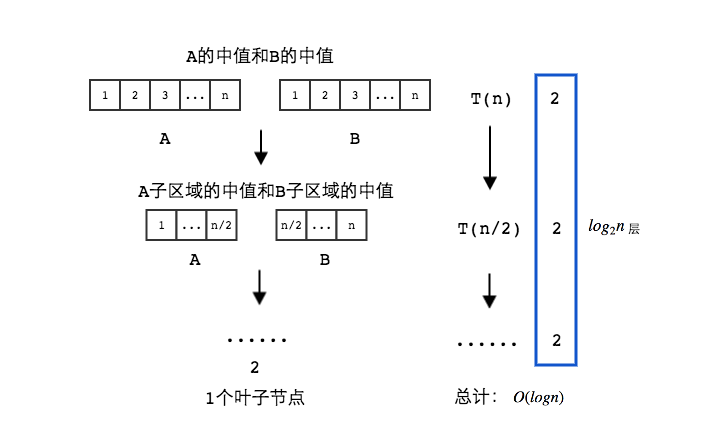
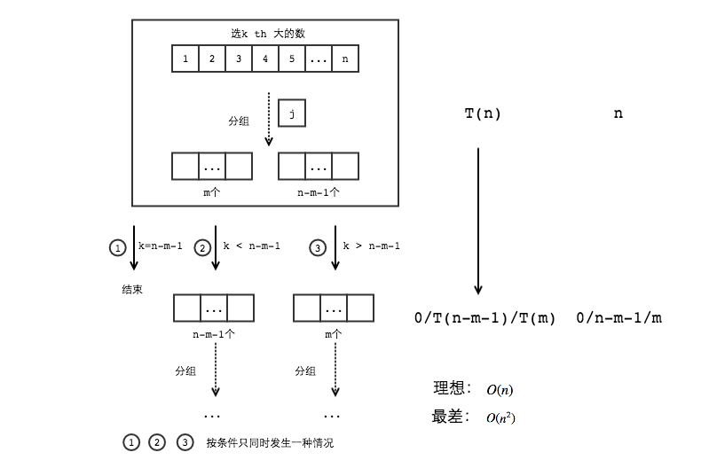
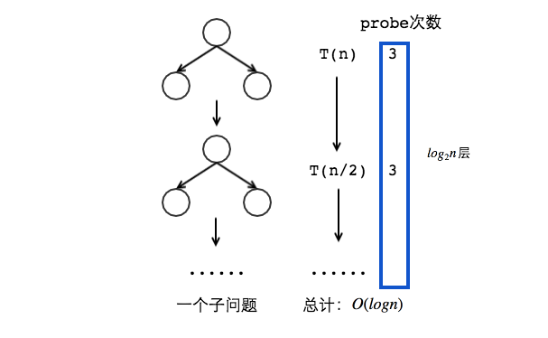

# <center>算法设计与分析第一次作业 - 分治策略</center>

<center>201628013229058 洪鑫</center>

## 问题一 （1）

>
>You are interested in analyzing some hard-to-obtain data from two separate databases. Each database contains n numerical values, so there are $2n$ values total and you may assume that no two values are the same. You’d like to determine the median of this set of $2n$ values, which we will define here to be the $n^{th}$ smallest value.
>
>However, the only way you can access these values is through *queries* to the databases. In a single query, you can specify a value k to one of the two databases, and the chosen database will return the $k^{th}$ smallest value that it contains. Since queries are expensive, you would like to compute the median using as few queries as possible.
>
>Give an algorithm that finds the median value using at most $O(log n)$ queries.
>

### 1. 算法描述与伪代码
令分离的两个数据库分别为$A$和$B$。

**基本思路：**所求的中值必然在$A$的中值和$B$的中值之间。基于此，可以划分子问题，子问题也满足同样的规律。

**算法：**

- 函数$Query(D,k)$用来返回数据库$D$中第$k$小的数。
- 函数$Median(A,low1,high1,B,low2,high2)$用来获取数据库$A$从$low1^{th}$到$high1^{th}$的数加上数据库$B$从$low2^{th}$到$high2^{th}$的数的中间值，比如：$Median(A,1,n,B,1,n)$即为问题所求。

$Median(A, low1, high1, B, low2, high2):$

<pre>
k1 = (low1 + high1) / 2;    // k1 is the index of median
1. k2 = (low2 + high2) / 2;
median1 = Query(A, k1);
median2 = Query(B, k2);

if Median1 < Median2 then
    if low1 == high1 && low2 == high2 then
        return median1;
    else 
        if (high1 - low1) is even
            return Median(A, k1, h1, B, l2, k2); 
        // make sure left part and right part have equal number of  elements
        else
            return Median(A, k1 + 1, h1, B, l2, k2);
else
    if low1 == high1 && low2 == high2 then
        return median2;
    else
        if (high1 - low1) is even
            return Median(A, l1, k1, B, k2, h2);
        // make sure left part and right part have equal number of  elements
        else
            return Median(A, l1, k1, B, k2 + 1, h2);
</pre>    
    
### 2.子问题缩减图

        

### 3. 正确性证明：（归纳法）
1. 当 $n=1$，$A$和$B$中都只有一个元素，算法返回较小的数，满足问题的要求。
2. 假设对于$n\le k-1$算法得到正确结果。假设$n$是偶数，那么对于$n=k$。    令$A$中的中值为$m_1$，$B$中的中值为$m_2$，$A+B$的中值为$m$。假设$m_1 > m_2$，算法返回$A[1, {n\over2}]$和$B[{n\over 2} + 1, n]$中所有数的中值。**首先**，有$m_1 \ge m \ge m_2$，因为如果$m > m_1$，那么$B$中$[1, n/2]$的数都要比$m$小，加上$B$中${n\over2}$个数，至少有$n$个数小于$m$，违背了中值的定义，同理$m < m_2$也不成立。**其次**，根据中值的定义，在$A[1, {n\over2}]$和$B[{n\over 2} + 1, n]$中，有${n\over2}$个数是小于或等于$m$的，有${n\over2}$个数是大于$m$的。而${n\over2}\in\{1,2,...,n-1\}$，对于$n$是偶数，$m_1 < m_2$的情况同理可证。$m$满足题目的要求。所以$n=k$时满足问题要求。

根据归纳法定义，算法正确。

### 4. 运行时间分析
每次只会产生一个子问题，问题的大小减半，每个子问题中使用两次查询。所以有：
$$
T(n) = 
\begin{cases}
2,  & {n=1} \\
T(n/2)+2, & {n \ge 2}
\end{cases}\\
$$  

根据主定理，有：$$T(n) = O(logn)$$
  

## 问题二 （2）
>
>Find the $k^{th}$ largest element in an unsorted array. Note that it is the $k^{th}$ largest element in the sorted order, not the $k^{th}$ distinct element.
>
>INPUT: An unsorted array $A$ and $k$.
>
>OUTPUT: The $k^{th}$ largest element in the unsorted array $A$.
>

### 1. 算法描述与伪代码

**基本思路：**基于快速排序思想的快速选择方法。首先随机选择一个数作为轴点，所有的数与这个轴点进行比较，分为大小两组。则会出现三种情况：
1. 大于轴点的数有$k-1$个，返回这个轴点
2. 如果大于轴点的数大于$k-1$个，递归调用返回大的那组的第$k$大的数
3. 如果大于轴点的数小于$k-1$个，令大的那组个数为$m$，递归调用返回小的那组的第$k-m-1$大的数。
**算法：**

$QuickSelect(A, k)$

<pre>
if |A| == 1 and k == 1 then
    return A[1];
else
    ERROR;
end if
    
choose a splitter A[j] randomly;
for i = 0 to n - 1 do
    if i != j then
        Put A[i] in S− if A[i] < A[j];
        Put A[i] in S+ if A[i] >= A[j];
    end if
end for

if |S+| == k then
    return A[j];
else if |S+| > k then
    return QuickSelect(S+, k);
else
    return QuickSelect(S-, k - |S+| - 1);
end if
</pre>

### 2. 子问题缩减图


### 3. 正确性证明（归纳法）
1. $|A|=1,k=1$时，返回数组第一个元素，满足问题要求。
2. $|A|\le n,k \le d$时，假设算法正确。
    - 当$|A|=n+1,k=d$时，根据算法，第一次运行后出现三种情况。第一种，直接返回轴点，满足问题要求。后两种情况，必然有$|S+|\le n,|S-|\le n,(k-|S+|-1)<d$ ，根据假设，算法返回正确结果。
    - 当$|A|=n,k=d+1$时，根据算法，递归时出现第一种，直接返回轴点，满足问题要求。出现第三种，必然有$|S-|\le n,(k-|S+|-1)<d$，根据假设，算法返回正确结果。假设第二种情况持续发生，因为轴点排除在数组之外，数组大小持续减少，必然在某一时刻，使得$|S+|=k$，导致第二种情况不再满足。进而进入第一种或第三种情况，最终得到正确结果。

综上所述，根据双重归纳法定义可以证明该算法正确。

### 4. 运行时分析
与快速排序运行时计算方式同理，可得：

- 最差情况：（取最大/最小值，每次随机选择的是最小/最大值）$$T(n) \le T(n-1)+cn \Rightarrow T(n)=O(n^2) $$
- 理想情况：(轴点总选在在中点处)$$T(n)\le T(n\,/\,2)+cn\Rightarrow T(n)=O(n)$$
- 大部分情况：通常轴点在中心点附近，此时依然有$$T(n)=O(n)$$

## 问题三 （3）
>
>Consider an n-node complete binary tree $T$, where $n = 2^d − 1$ for some $d$. Each node $v$ of $T$ is labeled with a real number $x_v$. You may assume that the real numbers labeling the nodes are all distinct. A node $v$ of $T$ is a local minimum if the label $x_v$ is less than the label $x_w$ for all nodes $w$ that are joined to $v$ by an edge.
>
>You are given such a complete binary tree $T$ , but the labeling is only specified in the following *implicit* way: for each node $v$, you can determine the value $x_v$ by probing the node $v$. Show how to find a local minimum of $T$ using only $O(log\,n)$ probes to the nodes of $T$ .
>

### 1. 算法描述与伪代码

**基本思路：**对于寻找一个局部最小点的问题，可以转化为探究每个节点的值和两个叶子节点值的最小值，即$min(this, leave_l, leave_r)$。如果该节点值为最小，返回该节点为局部最小点。否则，探究值最小的那个节点。

**算法：**
- root 表示根节点
- this表示当前节点，this->left表示当前节点的左叶子节点，this->right表示当前节点的右叶子节点
- porbe(node)返回该节点的值
- min(a,b,c)返回a,b,c三个节点中值最小的节点
- $FindLocalMin(node)$返回以node为根节点的一个局部最小点，$FindLocalMin(root)$即为所求

$FindLocalMin(node)$

<pre>
if node has no leave then
    return node;
min_node = min(node, node->left, node->right);
if min_node == node then
    return node;
else
    return FindLocalMin(min_node);
</pre>

$min(a, b, c)$

<pre>
valuea = probe(a);
valueb = probe(b);
valuec = probe(c);

minimum = a;
min_value = valuea;

if valueb < min_value then
    minimum = b;
    min_value = valueb;

if valuec < min_value then
    minimum = c;
    
return minimum;   
</pre> 

### 2. 子问题缩减图


### 3. 正确性证明（归纳法）
1. 当$d=1$，根据算法，返回根节点为局部最小点。
2. 当$d=n-1$时，假设算法成立。对于$d=n$，根据算法，如果根节点的两个叶子节点的值都比根节点值要大，返回根节点，符合问题要求。如果不是，则寻找以值最小的那个节点为根节点的二叉树，的局部最小点。问题化为求$d=n-1$时的问题，根据假设，可以得到局部最小点。

根据归纳法定义，算法正确。

### 4. 运行时间分析
每次产生一个子问题，每个子问题需要进行三次probe，即获取三个节点的值，有：
$$
T(n) = 
\begin{cases}
1,  & {d=1} \\
T(n\,/\,2)+3, & {d \ge 2}
\end{cases}\\
(n = 2^d - 1)
$$  
根据主定理，可得：
$$T(n)=O(log\,n)$$
    


## 问题四 （8）

>
>The attached file Q8.txt contains 100,000 integers between 1 and 100,000 (each row has a single integer), the order of these integers is random and no integer is repeated.
>
>1. Write a program to implement the Sort-and-Count algorithms in your favorite language, find the number of inversions in the given file.
>
>2. In the lecture, we count the number of inversions in O(n log\,n) time, using the Merge-Sort idea. Is it possible to use the Quick-Sort idea instead ?
If possible, implement the algorithm in your favourite language, run it over the given file, and compare its running time with the one above. If not, give a explanation.
>

### 1. python 实现排序计逆序数算法
``` python
from random import randint


def sort_and_count(array):
    """ Use Merge-Sort Idea to count inversions.

    :param array: target for inversions counting
    :return:
        inversion_count: count of inversion pair in array
        array_sorted: array sorted from small to large
    """

    size = len(array)

    # Stop condition of recursive call:
    # 1. When array only contains one element, number of inversions is 0
    #  and return itself.
    if size == 1:
        return 0, array
    # 2. Compare them when array contains two elements
    #  if contains a inversion, reverse two elements and number set to 1.
    if size == 2:
        if array[0] > array[1]:
            return 1, [array[1], array[0]]  # or array.reverse()
        else:
            return 0, array

    # Divide array into left and right parts from the middle.
    split_location = size / 2
    array_left = array[:split_location]
    array_right = array[split_location:]

    # Recursively call to sort_and_count left and right parts.
    count_left, array_left_sorted = sort_and_count(array_left)
    count_right, array_right_sorted = sort_and_count(array_right)

    # Merge after recursively call.
    count_merge, array_sorted \
        = merge_and_count(array_left_sorted, array_right_sorted)

    # Sum the inversion count of three parts.
    inversion_count = count_left + count_right + count_merge

    return inversion_count, array_sorted


def merge_and_count(array_x, array_y):
    """ Merge two sorted array with order and count the number of inversions

    :param array_x: sorted array from small to large order
    :param array_y: sorted array from small to large order
    :return:
        merge_inversion_count: number of inversions between array_x and array_y
        array_sorted: merge array_x and array_y into one array with order from
            small to large
    """
    size_x, size_y = len(array_x), len(array_y)
    index_x = index_y = 0
    merge_inversion_count = 0
    array_sorted = []

    while True:
        # In this situation, there is no element hasn't been compared
        #  in array_x, merge the elements reserved in array_y
        if index_x >= size_x:
            array_sorted += array_y[index_y:]
            break

        # Like the situation above.
        if index_y >= size_y:
            array_sorted += array_x[index_x:]
            break

        # Compare element of array_x and array_y and put smaller element into
        #  sorted array.
        # When put an element of array_y into array_sorted, it means every
        #  element reserved in array_x is bigger than it. Additional
        #  array_x_reserved_count inversions.
        if array_x[index_x] < array_y[index_y]:
            array_sorted.append(array_x[index_x])
            index_x += 1
        else:
            array_sorted.append(array_y[index_y])
            merge_inversion_count += size_x - index_x
            index_y += 1

    return merge_inversion_count, array_sorted


# Read file and return an array
def read_file(file_path):
    f = open(file_path, 'r')
    content = f.readlines()
    array = map(int, content)
    return array

# Run the algorithm
arr = read_file('./Q8.txt')
print sort_and_count(arr)[0]

```
### 2. 运行结果
2500572073 

### 3. 无法使用快速排序的思想解决该问题
因为在对元素进行比较分组时，改变了元素的位置，而因改变位置的同时，逆序数数量发生了变化，变化的大小无法获取。所以无法使用快速排序的思想解决问题。


## 问题五 （11）
>
>Implement the Karatsuba algorithm for Multiplication problem in your favourite language, and compare the performance with quadratic grade-school method.
>

### 1. python实现Karatsuba算法

``` python
def karatsuba(x, y):
    """ Multiply two numbers with more efficient way than grade school's

    :param x: number one to multiply
    :param y: number two to multiply
    :return: product of x and y
    """

    # maximum length of x and y
    max_len = max(len(str(x)), len(str(y)))

    # stop condition of recursive call
    # Stop when one of the value equals 0 or their length equal 1
    if x == 0 or y == 0:
        return 0
    if max_len == 1:
        return x * y

    # Split x and y into high part and low part
    # It's easier for a human
    splitter = 10 ** (max_len / 2)  # Set the split location
    x_high = x // splitter
    x_low = x - x_high * splitter
    y_high = y // splitter
    y_low = y - y_high * splitter

    # parts will be used in product computing
    high_high = karatsuba(x_high, y_high)
    low_low = karatsuba(x_low, y_low)

    # The trick: grade school multiply twice. Only once in this way
    # One time multiply to get the result of x_high * y_low + x_low * y_high
    high_lows = (karatsuba(x_high + x_low, y_high + y_low)
                 - high_high - low_low)

    # Calculate the product of x and y by using computed parts
    result = (high_high * (splitter ** 2)
              + high_lows * splitter + low_low)

    return result


print "Input two number:"
num_a, num_b = map(int, raw_input().split())
print "Multiple Result: ", karatsuba(num_a, num_b)
```
### 2. 与小学计算方法的性能比较
- 小学计算方法：使用了四次乘法 $$T(n)=4T(n\,/\,2)+cn \Rightarrow T(n)=O(n^{log_24})=O(n^2)$$
- Karatsuba算法：使用了三次乘法 $$T(n)=3T(n\,/\,2)+cn \Rightarrow T(n)=O(n^{log_23})=O(n^{1.585})$$
